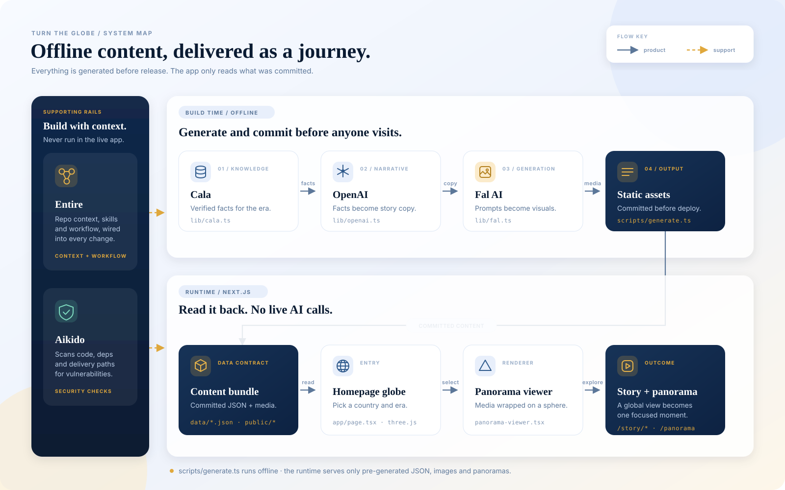

# Calamari — Turn the Globe

**Turn the Globe** is an interactive historical storytelling experience. Spin a 3D globe, select a country, and enter a scroll-driven story of the era that most shaped it. Each moment combines a source-backed historical fact, concise narrative copy, and an original illustrated visual.

The project was built for the **{Tech: Europe} × Cala Hackathon** in Barcelona, in the Visual Storytelling track.

## System map



> Offline content, delivered as a journey. Research and generation happen before
> release; the runtime only reads committed JSON, images and panoramas.

**[Open the interactive map →](docs/system_map.html)** — richer detail and hover states. GitHub
shows this file as source, so download it or open it locally in a browser; if you enable GitHub
Pages for this repository it is also served at `/{repo}/system_map.html`.

<details>
<summary>Pipeline at a glance</summary>

| Stage | Does | File |
| --- | --- | --- |
| Cala | Dated events with source provenance | `backend/stage1_facts.py` |
| OpenAI | Events → image prompts | `backend/stage2_prompts.py` |
| fal.ai | Prompts → 21:9 panorama stills | `backend/stage3_images.py` |
| fal.ai | Stills → 10-second silent videos | `backend/stage4_videos.py` |
| Commit | Versioned manifests and media | `backend/output/<country>/` |
| Runtime | Reads committed content only | `frontend/app/page.tsx` |

The frontend's `lib/cala.ts`, `lib/openai.ts` and `lib/fal.ts` are **mock** adapters used by
`scripts/generate.ts` for offline UI work. The real generation is the Python pipeline above.

</details>

> Current frontend demo: Spain. The generation pipeline is country-parameterised and already has sample output for Spain and Portugal.


## Contents

- [How it works](#how-it-works)
- [Technology](#technology)
- [Quick start](#quick-start)
- [Generate country media](#generate-country-media)
- [Local generation API](#local-generation-api)
- [Work on the project](#work-on-the-project)
- [Data, AI, and provenance](#data-ai-and-provenance)
- [Project structure](#project-structure)
- [Known limitations](#known-limitations)

## How it works

The repository contains two intentionally separate systems:

1. **The frontend** is a static Next.js experience. It never makes an AI call when a visitor opens the site. It loads reviewed JSON and media committed to the repository, which keeps the demo fast, dependable, and predictable in cost.
2. **The backend pipeline** generates a country's facts, prompts, images, and optional videos before they are shown in a product. It can be run from the command line or through a local FastAPI queue.

```text
Build-time generation

  Cala ──► verified, dated events and source provenance
             │
             ▼
  OpenAI ─► narrative-safe image prompts
             │
             ▼
  fal.ai ─► illustrated panorama stills ──► optional 10-second videos
             │
             ▼
  backend/output/<country>/  (JSON manifests + local media)

Runtime experience

  Next.js + React ──► react-globe.gl / Three.js ──► country story from static data
```

The frontend's original offline generator (`frontend/scripts/generate.ts`) remains mock-based for safe end-to-end UI development. The production-style Python pipeline is separate and writes to `backend/output/`; it does **not** automatically update the frontend's static story data.

## Technology

| Area | Technology | Version used |
| --- | --- | --- |
| Web framework | Next.js (App Router) | 13.4.19 |
| UI | React and React DOM | 18.2.0 |
| Language | TypeScript | 5.5.4 |
| Globe | react-globe.gl | 2.25.0 |
| 3D rendering | Three.js | 0.150.1 |
| Styling | Tailwind CSS | 3.4.10 |
| Build tooling | PostCSS / Autoprefixer | 8.4.41 / 10.4.20 |
| Linting | ESLint + `eslint-config-next` | 8.57.0 / 13.4.19 |
| Offline script runner | tsx | 3.12.7 |
| Country-generation pipeline | Python standard library (`urllib`) | Python 3.8+ |
| Local job API | FastAPI / Pydantic / Uvicorn | `>=0.110,<1.0` / `>=2,<3` / `>=0.27,<1.0` |
| Fact retrieval | Cala | API service |
| Narrative and prompts | OpenAI API | model defaults to `gpt-5` |
| Images | fal.ai `fal-ai/nano-banana-pro` | 21:9, 2K JPEG |
| Video | fal.ai `blackforestlabs/flux-3/image-to-video` | 10 seconds, 720p, no audio |

## Quick start

### Prerequisites

- Git
- Node.js **16.8+** (Node.js 18+ is recommended)
- npm
- Python **3.8+**

AI keys are **not** required to run or edit the frontend. They are needed only for live backend generation.

### Clone and install

```bash
git clone --branch codex-generate-fal-photos https://github.com/FuzzySid/calamari-project.git
cd calamari-project

cd frontend
npm install
```

To work from a different branch, omit `--branch codex-generate-fal-photos` and switch to the branch you need after cloning.

### Run the web app

```bash
cd frontend
npm run dev
```

Open [http://localhost:3000](http://localhost:3000). Use the globe to select Spain and enter the story.

### Build, lint, and test

```bash
# Frontend — run from frontend/
npm run lint
npm run build
npm run start

# Backend unit tests — run from the repository root
python3 -m unittest discover -s tests -q
```

## Generate country media

The backend has four restartable stages. Each writes a manifest, so existing results are reused and a later stage can be repeated without regenerating earlier work.

```text
Stage 1: Cala      → facts and sources        → info.json
Stage 2: OpenAI    → image prompts            → prompts_image.json
Stage 3: fal.ai    → panorama images          → images.json + images/
Stage 4: fal.ai    → optional motion videos   → videos.json + videos/
```

### Configure API keys

Create a `.env` file at the **repository root**. It is ignored by Git.

```dotenv
CALA_API_KEY=your-cala-api-key
OPENAI_API_KEY=your-openai-api-key
FAL_API_KEY=your-fal-api-key

# Optional: defaults to gpt-5
OPENAI_MODEL=gpt-5
```

`FAL_KEY` is also accepted in place of `FAL_API_KEY`. Shell environment variables take precedence over `.env` values.

### Run a country pipeline

```bash
# Images only — facts → prompts → images
python3 backend/run_pipeline.py --country Spain

# Include the optional, slower video stage
python3 backend/run_pipeline.py --country Portugal --with-videos

# Process several countries sequentially
python3 backend/run_pipeline.py --countries Spain Japan Brazil
```

For controlled regeneration:

```bash
# Preview Stage 2 and 3 inputs without calling OpenAI or fal.ai
python3 backend/run_pipeline.py --country Spain --dry-run

# Regenerate one event in a specific stage
python3 backend/stage3_images.py --country Spain --only spanish_armada_1588 --force
```

The output is written to `backend/output/<country-slug>/`. Do not use `--force` casually: it triggers paid generation. Images have deterministic seeds; forced video renders create a new video seed.

For the complete pipeline contract, output schema, stage flags, and media limitations, see [the backend README](backend/README.md).

## Local generation API

The optional FastAPI service puts country generation jobs into a local queue so a client never waits on a full pipeline run. Install its dependencies once:

```bash
python3 -m pip install -r backend/requirements.txt
```

Run the API and worker in separate terminals from the repository root:

```bash
# Terminal 1
python3 -m uvicorn backend.api.app:app --host 127.0.0.1 --port 8000

# Terminal 2
python3 -m backend.api.worker
```

Useful endpoints:

| Endpoint | Purpose |
| --- | --- |
| `GET /api/health` | Check that the service is running |
| `GET /api/countries` | List known countries and generation status |
| `POST /api/countries/{iso3}/generate` | Queue one country; pass `{"name":"Portugal"}` |
| `GET /api/jobs/{job_id}` | Poll job progress |
| `GET /api/countries/{iso3}/media` | Read generated image and video metadata |
| `GET /media/<slug>/...` | Serve local generated media |

For example:

```bash
curl -X POST http://127.0.0.1:8000/api/countries/PRT/generate \
  -H 'Content-Type: application/json' \
  -d '{"name":"Portugal"}'
```

The service is intentionally local-only (`127.0.0.1`), has no authentication, and permits only the local frontend origins. It is a development tool, not a public production API.

## Work on the project

### Frontend work

- Work inside `frontend/` and use the npm commands above.
- The globe is a client component in `frontend/components/globe-experience.tsx`.
- Country stories are rendered from static data in `frontend/app/story/[code]/page.tsx`.
- Read country JSON through `frontend/lib/data.ts`; do not add a runtime API call for content that is meant to be static.
- Keep generated user-facing assets in `frontend/public/` and content contracts in `frontend/data/`.

### Backend work

- Run backend commands from the repository root.
- Keep shared parsing, file, environment, and seed logic in `backend/pipeline_common.py`.
- Treat the Stage 1 event ID as the stable join key across all pipeline manifests. This enables targeted `--only` regeneration without disturbing other events.
- Review generated images and videos before committing them. Generated media is product content, not disposable build output.

### Contribution checklist

1. Create a focused branch from the intended base.
2. Make the smallest cohesive change; do not mix generated media with unrelated refactors.
3. Run the applicable frontend lint/build and backend tests.
4. If generation changed, inspect the JSON manifests and every visual asset before committing.
5. Update this README or the specialised README when commands, environment variables, models, or data contracts change.

## Data, AI, and provenance

### Cala: the factual foundation

Cala is the knowledge layer. Stage 1 retrieves historically relevant events, filters them to dated moments, and preserves source provenance. Its source resolver follows Cala's explanation references through the returned context and source origins; it never invents dates when Cala has not supplied one.

That matters because the product's credibility depends on every historical claim being traceable. Cala provides the evidence; it is not used merely as a search box.

### OpenAI: narrative and visual direction, not a fact source

OpenAI converts the retrieved event material into image-generation prompts. The default backend model is `gpt-5`, configurable with `OPENAI_MODEL` or `--openai-model`.

OpenAI must not introduce historical claims beyond the Cala-backed event. The frontend data model keeps `factText` and `narrativeCopy` separate so this distinction remains visible and reviewable.

### fal.ai: media generation

fal.ai creates the illustrated assets after the event and prompt have been reviewed:

- `fal-ai/nano-banana-pro` creates 2K JPEG panoramas using the repository's restrained museum-editorial style profile.
- `blackforestlabs/flux-3/image-to-video` turns those stills into ten-second, silent videos with subtle ambient motion.

The style profile intentionally favours landscapes, objects, architecture, maps, textiles, and ships over photorealistic portrayals of identifiable historical people. Every asset should belong to one coherent visual sequence rather than chase a spectacular one-off image.

### Why generation is offline

Keeping AI calls outside the runtime app gives the experience three practical advantages: visitors get a fast, stable page; API availability cannot break the demo; and each asset can be reviewed for factual, visual, and ethical quality before it is published. It also makes costs intentional instead of tying them to traffic.

## Project structure

```text
frontend/                         Next.js application
  app/                            Home, panorama, and story routes
  components/                     Globe and panorama experiences
  data/                           Static story and geographic data
  lib/                            Data access and mock generation adapters
  public/                         Committed images and video assets
  scripts/generate.ts             Mock-only offline UI content generator

backend/                          Country generation system
  stage1_facts.py                 Cala fact retrieval and source provenance
  stage2_prompts.py               OpenAI image prompt generation
  stage3_images.py                fal.ai panorama image generation
  stage4_videos.py                fal.ai image-to-video generation
  run_pipeline.py                 Country/batch pipeline runner
  api/                            Local FastAPI service and background worker
  output/<country>/               Generated manifests, images, and videos
  styles/                         Shared visual-generation profiles

tests/                            Python standard-library unit tests
```

## Known limitations

- **The generated panoramas are not true 360° equirectangular media.** `fal-ai/nano-banana-pro` does not accept the required 2:1 ratio, so the project uses a 21:9 ultra-wide format instead.
- The frontend and the Python pipeline are currently disconnected by design. Moving backend output into a frontend story remains a deliberate integration step, not an automatic side effect.
- The frontend currently ships a polished Spain story rather than universal country coverage.
- The local generation API has no authentication and must not be exposed publicly as-is.

## Further reading

- [Frontend development guide](frontend/README.md)
- [Backend pipeline and API guide](backend/README.md)
- [Cala](https://www.cala.ai/)
- [OpenAI](https://openai.com/)
- [fal.ai](https://fal.ai/)
